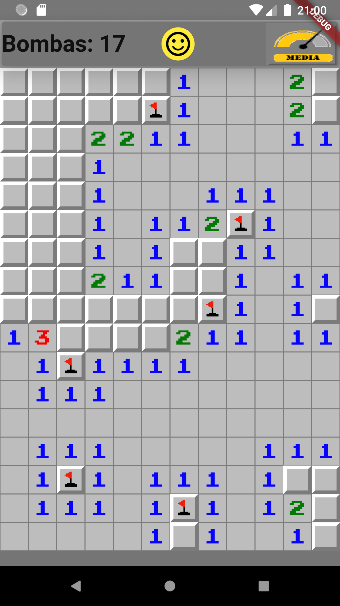
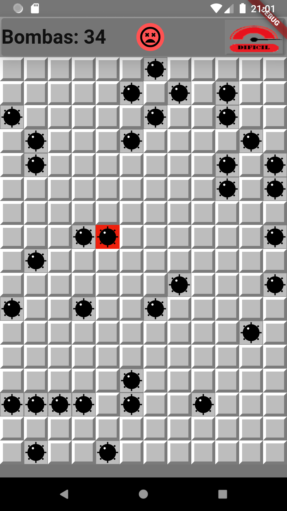

# Campo Minado

Exercício para aprendizado do Flutter e Dart.

<div align="center">
  
  
</div>

---

# Develop

## Comandos para recriar a estrutura para o Android

```bash
# Recriar o projeto os arquivos de configuração para o Android 
flutter create --platforms android --project-name campo_minado --org edu.treino --android-language kotlin .

# Para baixar das dependencias 'pubspec.yaml'
flutter pub get

# Para mudar os ícones do aplicativo Android Instalado
flutter pub run flutter_launcher_icons:main

# Para mudar o nome do aplicativo no Android
flutter pub run flutter_app_name

```

---

## Comandos para verificar o emulador
```bash

# versão do Android Debug Bridge
adb --version

# Listar os dispositovos ativos
adb devices -l

# versão do sistema para suportar os dispositivos
emulator --version

# Listar os dispositivos disponíveis
emulator -list-avds

```